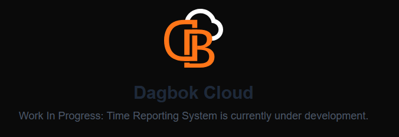

# Dagbok — a smart calendar

**A full-stack project with a focus on simple design, flexibility, and the integration of artificial intelligence into everyday tasks.**

**Next.js & Spring Boot**

🚀 Project Deployment

At the moment, the project is fully deployed using Docker and is publicly accessible via Cloudflare.

The application runs inside Docker containers managed with Docker Compose, which ensures a consistent and reproducible environment across different systems.

Cloudflare is used as a reverse proxy and CDN to provide:

Secure HTTPS access

Improved performance

Protection and reliability

🌐 Live URL: https://dagbok.cloud/

